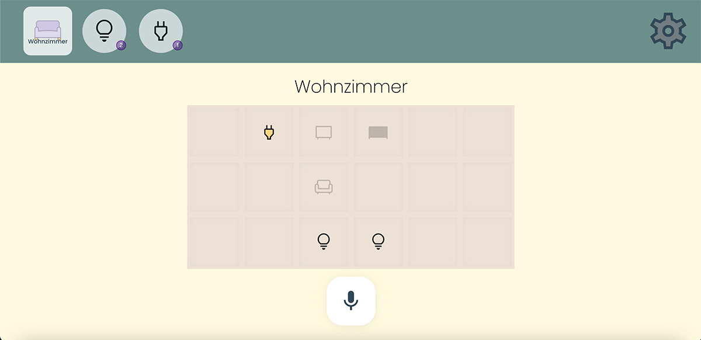

# Mimosa-GUI
*This project is currently under development.*  

## Introduction
Web GUI for a Multimodal Smart Home Assistance System.  
With the Mimosa GUI you can easily access Smart Items like lights and power sockets in different locations of your Smart Home.  

### Locations
Currently, a fixed setup of default locations and items is used to display a Smart Home example.  
The locations are planned to be created by the user in an easily understable way providing room size a room name and by placing decorative assets onto the fields created. These decorations help understanding where you are in the Graphical User Interface (GUI).

## Requirements
Make sure you have [node.js](https://nodejs.org/en/) installed.

## Documentation
An extended documentation in german language can be found on the [Mimosa Website](www.mimo-sa.de).

## Installation
```
git clone https://github.com/tdilger/Mimosa-GUI.git  
cd mimosa-gui  
npm run build && npm run serve
```  

If you want to use pnpm instead, you can just perform:  
```
pnpm run build && pnpm run serve
``` 
instead.

## Example
A lightweight navigation bar is used to switch through different locations in the home. You can also click on the items to display a menu to perform actions on more than one item of that kind at once.  

In the location field, you can tap on an item to open up a menu with the different opions the items offers. The light in this example would have the options on / off, changing *Brightness* and changing the *Color* of the light.  
The power socket, which can only be turned on or off, does not open up an extra menu. Instead, the option is executed directly, which provides a clear and fast, straight-forward way of interacting with the Smart Items in your home.  



## Contributing
You are warmly invited to participate enhancing this project.  
If you want to contribute:  
1. Create an issue describing the feature
2. Clone the repository
3. Create an individual branch for your extension or fixup
4. Submit a pull request describing your changes onto the development branch. 

## Build on
The Mimosa GUI is built with the [SolidJS](https://www.solidjs.com/) JavaScript framework using TypeScript.  
The framework ships with [*Vite* Build Tool](https://vitejs.dev/) supporting instant server start in development and optimized build.  
Styling is facilitated via tailwindcss.

## License
This project is licensed under [Apache 2.0 License](LICENSE).  
Copyright 2022 by Tim Dilger.